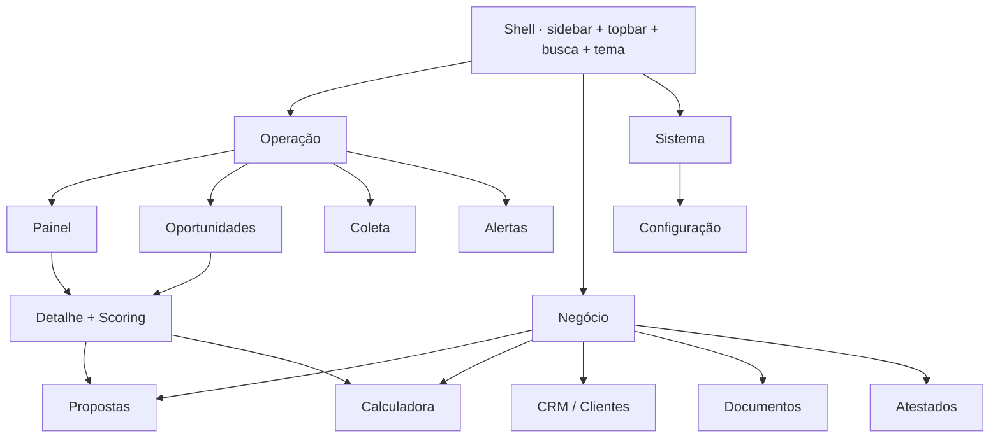

# UI Design Brief — Sistema Danzeroum (Buscador de Oportunidades)

> **Documento de orientação para o designer/dev de UI.** Não é implementação de produção.
> Amarra os contratos do repositório (modelo de dados, scoring, CLI, config) a um inventário
> completo de telas, priorizado por fase do roadmap. Acompanha um protótipo hi-fi navegável
> (`Danzeroum - Buscador de Oportunidades.html`) que materializa este brief.

---

## 1. Visão geral & objetivo

**O que é.** O rastreador de licitações da Danzeroum é hoje **headless**: opera apenas por CLI
(`schema` / `search` / `collect` / `list` / `report` / `schedule`) e Docker; o CRM são arquivos JSON.
Este brief responde a **duas perguntas**:

- **(a) As telas existem?** → Seção 2 (levantamento "existe vs. falta").
- **(b) Como o designer lê o repositório para criar todas as telas?** → Seção 3 (mapa de fontes de verdade).

**Para quem.** Designer de UI / desenvolvedor front-end que vai desenhar e construir a camada
operacional (administração e uso) cobrindo **todas as funcionalidades propostas** — não só a V1.

**O que NÃO é.** Não é especificação de back-end, não é implementação, não substitui o `BLUEPRINT.md`
(visão de produto). É o elo entre "o que o sistema já sabe fazer" e "como isso vira interface".

---

## 2. Levantamento do estado atual da UI

### Existe vs. falta

| Camada | Existe hoje? | Forma de acesso | Onde |
|---|---|---|---|
| Site institucional | ✅ Sim | Estático (HTML) | `public/index.html`, `contato.php`, `obrigado.html`, `404.html` |
| Design system | ✅ Sim (embutido) | Tokens + tipografia no `<style>` | `public/index.html` + `brand/tokens.css` |
| **Telas de operação/uso** | ❌ **Não — 100% ausente** | — | — |

### Por entidade (modelo de dados) → como se acessa hoje

| Entidade (`schema.sql`) | Existe na UI? | Acesso atual |
|---|---|---|
| `tenders` (editais) | ❌ | CLI `list` / `report` (texto) |
| `score` (pontuação) | ❌ | CLI `report` (texto) |
| `documents` (certidões) | ❌ | Só no schema SQL |
| `proposals` (propostas) | ❌ | Só no schema SQL |
| `technical_certificates` (atestados) | ❌ | Só no schema SQL |
| `clients` (clientes/CRM) | ❌ | Arquivos `crm/*.json` |

**Conclusão:** existe o "site vitrine" + um design system maduro para herdar. **Falta toda a camada
operacional** — é o que este brief especifica.

---

## 3. Como o designer lê o repositório (mapa de fontes de verdade)

Núcleo do documento. Para cada **pergunta de design**, o arquivo que a responde:

| Pergunta de design | Fonte de verdade | O que extrair |
|---|---|---|
| Quais entidades, campos, tipos e enums existem? | `tracker/sql/schema.sql` | 6 tabelas; enums de `status`, `category`, `recommendation`, status de proposta, tipo de documento |
| O que renderizar num card de score? | `tracker/danzeroum_tracker/scoring/schema.py` | `SCORE_SCHEMA`: `fit`/`risk`/`complexity` (0–1), `recommendation` (GO/REVIEW/SKIP), `key_requirements[]`, `pricing_guidance`, `analysis_text` |
| Quais ações / botões / verbos a UI precisa? | `tracker/danzeroum_tracker/cli.py` | Cada comando = um caso de uso = uma ação de tela |
| Como é o dashboard? | `tracker/danzeroum_tracker/reporting.py` | `build_report`: `total`, `por_recomendacao`, `top[]` (source/title/url/budget/deadline/fit/risk/recommendation) |
| Quais filtros e parâmetros de configuração? | `tracker/danzeroum_tracker/config.py` + `.env.example` | fontes, UF, palavras-chave, modalidades, horizonte, `min_fit`, intervalo, scorer, SMTP |
| Como é o resultado de uma coleta? | `tracker/danzeroum_tracker/pipeline.py` | `CollectionResult`: `collected`/`new`/`scored`/`alerts`/`errors` por fonte |
| Marca, tokens, dark mode, grid? | `public/index.html` + `brand/tokens.css` | terracota `#bd4e1c`, teal `#0f7d6b`, marinho `#24324a`, IBM Plex Sans/Mono, tokens claro+escuro, maxw 1080px |
| Visão, módulos, prioridade, calculadora de preço? | `docs/buscador-oportunidades/BLUEPRINT.md` | roadmap V1→V4, Fator R / Simples Nacional |
| Dado bruto por fonte (drawer "ver original")? | coluna `tenders.raw_json` | JSON cru da fonte, exibido num drawer read-only |

**Sequência de leitura recomendada:** `schema.sql` → `scoring/schema.py` → `cli.py` → `reporting.py`
→ `config.py` → `public/index.html` → `BLUEPRINT.md`.

### Contratos-chave (resumo)

**`SCORE_SCHEMA`** (o card mais importante da interface):

```
fit            : float 0–1   → gauge "Aderência"
risk           : float 0–1   → gauge "Risco"
complexity     : float 0–1   → gauge "Complexidade"
recommendation : enum        → GO | REVIEW | SKIP   (badge semântico)
key_requirements: string[]   → checklist de habilitação (atendido / não)
pricing_guidance: string     → faixa de preço sugerida
analysis_text  : string      → parecer textual
```

**`CollectionResult`** (tela de coleta), por fonte: `collected`, `new`, `scored`, `alerts`, `errors`.

**`build_report`** (dashboard): `total`, `por_recomendacao{GO,REVIEW,SKIP}`, `top[]`.

---

## 4. Inventário de telas (todas as funcionalidades)

Cada tela lista: **objetivo · dados (tabela/arquivo) · ações (comando CLI) · estados**.
Os nomes de tela espelham o protótipo navegável anexo.

### 4.0 Shell / Navegação
- **Objetivo:** moldura comum — sidebar agrupada (Operação / Negócio / Sistema), topbar com busca global, tema claro/escuro, contadores ao vivo, perfil.
- **Dados:** contadores derivados (`tenders` ativos, alertas não lidos, documentos a vencer).
- **Ações:** navegar, buscar (FTS), alternar tema, "Coletar" (atalho global → `collect`).
- **Auth:** single-tenant na V1 (só a Danzeroum) — login simples, sem multiusuário.
- **Estados:** responsivo (<880px colapsa a sidebar).

### 4.1 Dashboard / Painel — `report`
- **Objetivo:** leitura de 5 segundos do estado das oportunidades e do funil.
- **Dados:** `reporting.build_report` → KPIs (`total`, GO/REVIEW/SKIP), `top[]`, pipeline potencial; prazos próximos (de `tenders.deadline`).
- **Ações:** ir para lista/detalhe; atalhos (rodar coleta, revisar pendências, calcular preço, documentos a vencer).
- **Estados:** vazio ("nenhuma coleta ainda"), carregando, erro.

### 4.2 Lista de oportunidades — `list` / `list_scored`
- **Objetivo:** triagem rápida de editais coletados e pontuados.
- **Dados:** `tenders` + `score` (join). Colunas: objeto, órgão/UF, fonte, valor estimado, fit, prazo, recomendação.
- **Ações:** filtrar (UF, categoria, status, recomendação, fit mínimo, prazo, fonte), busca FTS, ordenar (fit/prazo/valor), abrir detalhe.
- **Estados:** vazio (sem resultados p/ filtro), descartados ocultos por padrão.

### 4.3 Detalhe da oportunidade + Scoring ⭐ (vitrine)
- **Objetivo:** decidir participar — reúne edital + parecer da IA.
- **Dados:** todos os campos de `tenders` + objeto `SCORE_SCHEMA` + `tenders.raw_json`.
- **Componentes:** cabeçalho (badge recomendação, fonte, nº, valor, prazo); coluna esquerda (campos do edital + checklist `key_requirements`); **card de score** (3 gauges fit/risco/complexidade, banner de recomendação, `analysis_text`, `pricing_guidance`); drawer `raw_json`.
- **Ações:** "Ver no portal" (link externo), "raw_json" (drawer), "Gerar proposta" (→ propostas), "Calcular" (→ calculadora).
- **Estados:** edital sem score (ainda não pontuado), requisito não atendido (destaque).

### 4.4 Coleta / Execução — `collect` / `schedule`
- **Objetivo:** rodar e monitorar a varredura das fontes.
- **Dados:** `pipeline.CollectionResult`; histórico de execuções; `sources` (status, último run, erros); agendador.
- **Ações:** "Rodar coleta" (log ao vivo), ativar/desativar fonte, ver histórico, configurar agendamento.
- **Estados:** rodando (progresso + log), concluído (resumo), erro por fonte (ex.: timeout BEC-SP).

### 4.5 Configuração — `config.py` / `.env`
- **Objetivo:** parametrizar fontes, filtros, scoring e alertas.
- **Dados:** `config` (UFs, palavras-chave, modalidades, categorias, horizonte, `min_fit`, intervalo, scorer, SMTP).
- **Ações:** editar UFs/modalidades (chips), gerenciar palavras-chave, escolher scorer (heurístico / LLM futuro), ajustar `min_fit`, agendar, configurar SMTP.
- **Estados:** validação de campos; SMTP ativo/inativo.

### 4.6 Documentos & Certidões — `documents`
- **Objetivo:** controlar habilitação e validade (CND/CRF/CNDT/atestado).
- **Dados:** `documents` (tipo, emissor, emissão, validade, status válido/vencendo/vencido).
- **Ações:** enviar documento (upload), renovar, alerta de expiração.
- **Estados:** banner de pendência quando há certidão vencida/vencendo.

### 4.7 Propostas — `proposals`
- **Objetivo:** acompanhar o funil de propostas.
- **Dados:** `proposals` (status DRAFT/SENT/UNDER_REVIEW/WIN/LOST/DISQUALIFIED, valor, validade, versão, vínculo ao edital).
- **Ações:** kanban arrastável (mudar status), abrir proposta, vincular ao edital.
- **Estados:** coluna vazia; KPIs (em aberto, ganhas, valor ganho, taxa de vitória).

### 4.8 Calculadora de preço mínimo (BLUEPRINT / Fator R)
- **Objetivo:** estimar preço mínimo viável; standalone e plugada na proposta.
- **Dados:** entradas (receita, % folha, % custo direto, margem) → Fator R → Anexo III/IV (Simples) → preço mínimo.
- **Ações:** ajustar parâmetros (sliders), "usar este preço na proposta".
- **Estados:** Fator R ≥ 0,28 (Anexo III) vs. < 0,28 (Anexo IV); aviso de alíquota ilustrativa.

### 4.9 Atestados técnicos — `technical_certificates`
- **Objetivo:** portfólio de contratos para comprovar capacidade na habilitação.
- **Dados:** `technical_certificates` (cliente, objeto, valor, ano, volume, tags).
- **Ações:** novo atestado, vincular a requisito de edital.
- **Estados:** cards por contrato.

### 4.10 CRM / Clientes — `clients` + `crm/*.json`
- **Objetivo:** relacionamento e funil comercial por órgão.
- **Dados:** `clients` (estágio: qualificação/oportunidade/proposta/cliente, valor, contato, última interação, nº editais).
- **Ações:** novo cliente, mover no funil, ver editais vinculados.
- **Estados:** colunas de funil com soma por estágio.

### 4.11 Alertas / Notificações — `notifications.py` + `min_fit`
- **Objetivo:** central de avisos (oportunidade GO, prazo, certidão vencendo, coleta).
- **Dados:** alertas (tipo, nível, ref) disparados quando `fit ≥ min_fit` ou na janela de vencimento.
- **Ações:** marcar como lido, abrir referência, preferências de e-mail.
- **Estados:** não lidos destacados.

### 4.12 Transversais
Estados vazios, erros por fonte, responsividade, acessibilidade AA, PT-BR em toda a interface.

---

## 5. Arquitetura de informação & navegação



**Agrupamento:** *Operação* (descobrir e decidir) · *Negócio* (executar e vender) · *Sistema* (parametrizar).
**Auth:** single-tenant na V1; reservar espaço para multiusuário/papéis em fase posterior.

---

## 6. Design system a herdar

Extraído de `public/index.html` + `brand/tokens.css`. **Não inventar** — usar estes valores.

### Tokens (claro)
| Token | Valor | Uso |
|---|---|---|
| `--bg` / `--bg-2` | `#fbf7f1` / `#f4ece1` | fundo / superfícies alt |
| `--ink` / `--text` / `--muted` / `--faint` | `#231a14` / `#4a3d33` / `#7a6a5b` / `#9c8a78` | hierarquia de texto |
| `--line` / `--line-2` | `#e6dccd` / `#d3c4ae` | divisórias / bordas |
| `--brand` (terracota) | `#bd4e1c` (AA: `#b3470f`) | acento primário, botões |
| `--navy` (marinho) | `#24324a` | painéis escuros, avatares |
| `--teal` | `#0f7d6b` | status positivo |

### Tokens (escuro)
`--bg #141009` · `--bg-2 #1d160e` · `--ink #f6ede1` · `--brand #e8772f` · `--teal #36c0a4` · `--line #2e2418`.

### Cores semânticas de recomendação (novas, derivadas da marca)
| Recomendação | Claro | Escuro | Semântica |
|---|---|---|---|
| **GO** | `#0f7d6b` (teal) | `#36c0a4` | participar |
| **REVIEW** | `#c47915` (âmbar) | `#e0a13e` | revisar |
| **SKIP** | `#8a7a6a` (muted) | `#9a8870` | não participar |

### Tipografia
IBM Plex Sans (400–700) + IBM Plex Mono (400–600). Mono para rótulos/dados (`field-label`, valores tabulares).
Escala: h-page 1.5rem/600 · h-sec 1.06rem/600 · corpo 0.88–1rem · rótulo mono 0.66rem/.1em/uppercase.

### Raios & sombras
Raios 6/10/14/18px · easing `cubic-bezier(.2,.7,.3,1)` · sombras suaves quentes (ver `app/app.css`).

### Componentes novos a especificar
Badge de recomendação (3 variantes: outline/solid/minimal) · **gauge de score 0–1** · tabela densa ·
kanban · card de edital · card de score · drawer de `raw_json` · chips de filtro · calendário/pílula de prazo.

---

## 7. Priorização por fase (espelha o BLUEPRINT)

| Fase | Telas | Justificativa |
|---|---|---|
| **V1** | Painel · Oportunidades · Detalhe+Score · Coleta · Configuração | Núcleo: descobrir, pontuar e decidir editais |
| **V2** | Documentos · Propostas · Calculadora · CRM | Executar a participação e vender |
| **V3** | Atestados · Alertas avançados · automação/agendamento | Maturidade operacional |

---

## 8. Fluxo de trabalho sugerido ao designer

1. **Ler o repo** na ordem da Seção 3 (schema → SCORE_SCHEMA → cli → reporting → config → index.html → BLUEPRINT).
2. **Wireframes lo-fi** das 5 telas de V1 → validar fluxo (lista → detalhe → proposta).
3. **Fluxos** (descobrir → decidir → propor → acompanhar).
4. **Hi-fi** herdando os tokens; começar pelo **card de score** (mais denso em informação).
5. **Handoff** (specs de componente; este pacote + protótipo navegável).
6. **Entregáveis esperados:** wireframes → fluxos → hi-fi → specs de componente → protótipo.

> O protótipo `Danzeroum - Buscador de Oportunidades.html` (anexo) já cumpre os passos 4–5 para
> as 11 telas, em alta fidelidade, claro+escuro, com dados BR plausíveis (PNCP/ComprasNet/BEC-SP).

---

## 9. Pré-requisito técnico (nota, fora de escopo)

As telas leem/escrevem dados que hoje só existem via CLI e SQLite. Para virar app real será preciso
uma **camada de API** (ex.: FastAPI sobre o mesmo core/repo) expondo: `GET /tenders`, `GET /tenders/{id}`
(+ score + raw_json), `POST /collect`, `GET /report`, CRUD de `documents`/`proposals`/`clients`,
`GET/PUT /config`. Essa camada **não existe ainda** — é a primeira dependência de engenharia para a UI.

---

*Documento mantido por: time Danzeroum. Acompanha o protótipo hi-fi e o pacote de handoff
`design_handoff_buscador_oportunidades/`.*
